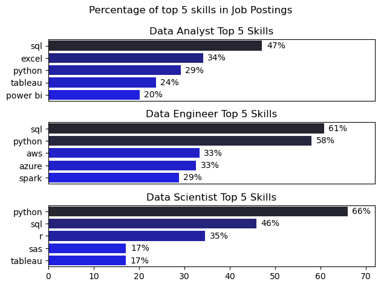
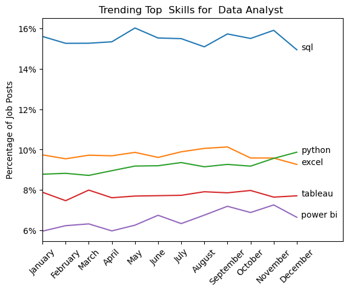
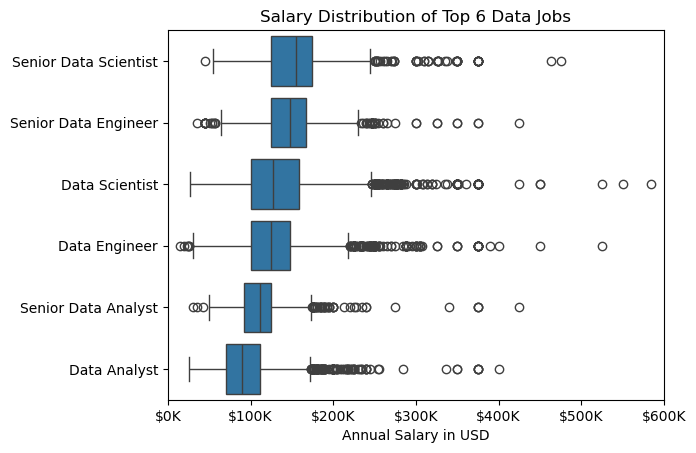
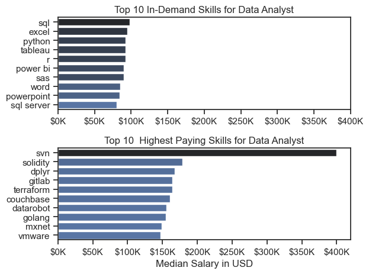
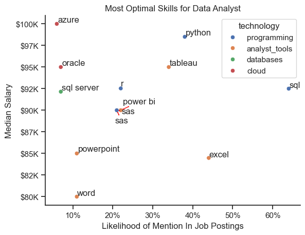

# THE ANALYSIS

## 1.What are the most demanded skills for top 3 data roles?

to find the most demanded skills  for top 3 most popular roles .I filtered all roles with maximum postings and then filtered skills for each role with top 5 count.

view my notebook 

[skill demand of top 3 data roles](./3_Project/2_Skills_Demand.ipynb)

### visualisation

   ```python
    fig,ax=plt.subplots(3,1)
    for i,job_title in enumerate(job_titles):
        df_plot= df_skills_percentage[df_skills_percentage['job_title_short']==job_title].head(5)
        sns.barplot(y='job_skills',x='percentage',ax=ax[i],hue="percentage",data=df_plot,palette='dark:b_r')
        ax[i].set_title(f'{job_title} Top 5 Skills')
    
        ax[i].set_ylabel('')
        ax[i].set_xlabel('')
        ax[i].legend().set_visible(False)
        ax[i].set_xlim(0,72)
        for n,v in enumerate(df_plot['percentage']):
            ax[i].text(v+1,n,f'{v:.0f}%',va='center')
        if i!=len(job_titles)-1:
            ax[i].set_xticks([])    
    plt.suptitle('Percentage of top 5 skills in Job Postings')
    plt.tight_layout()
    plt.show()

   ```


### result



### Insights

### **Role-Specific Insights**
- **Data Analyst**: SQL (47%) and Excel (34%) dominate, with growing Python (29%) adoption for advanced analysis.
- **Data Engineer**: SQL (61%) and Python (58%) are core, with AWS (33%) and Spark (29%) essential for cloud and big data.
- **Data Scientist**: Python (66%) and SQL (46%) lead, with R (17%) and Tableau (17%) for statistical analysis and visualization.

### **Overall Insights**
1. **SQL and Python Universality**: SQL and Python are foundational across all roles, emphasizing their importance in data querying, analysis, and automation.
2. **Tool Specialization**: While Data Analysts focus on visualization (Tableau, Power BI), Data Engineers prioritize cloud (AWS, Azure) and big data (Spark), and Data Scientists lean towards statistical tools (R, SAS).


## how in_demand skills trending for data roles?

   
```python
    sns.lineplot(data=df_plot,dashes=False,palette='tab10')
    plt.xticks(rotation=45)
    plt.ylabel('Percentage of Job Posts')
    plt.xlabel('')
    plt.title('Trending Top  Skills for  Data Analyst ')
    plt.legend().remove()
    plt.xlim(0,13)
    for i in range(len(df_plot.columns)):
        plt.text(11.2,df_plot.iloc[-1,i],df_plot.columns[i],color='black',fontsize=10)
    ax=plt.gca()
    ax.yaxis.set_major_formatter(PercentFormatter(decimals=0))    
    plt.show()

```

## Results



## Insights

1. **SQL**: Consistently the most in-demand skill for Data Analysts, appearing in a high percentage of job postings throughout the year.
2. **Python**: Increasingly important, reflecting its versatility in data analysis, automation, and advanced analytics.
3. **Excel**: Remains a staple skill for Data Analysts, essential for data manipulation and basic analysis tasks.
4. **Tableau**: A key tool for data visualization, highlighting the need for effective data presentation and storytelling.
5. **Power BI**: Growing in popularity, emphasizing the demand for business intelligence and interactive reporting capabilities.


## salary analysis of top 6 data jobs


### visualization
```python

sns.boxplot(y='job_title_short',x='salary_year_avg',data=df_Top_6,order=job_order)
plt.xlabel('Annual Salary in USD')
plt.ylabel('')
plt.title('Salary Distribution of Top 6 Data Jobs')
plt.xlim(0,600000)
plt.gca().xaxis.set_major_formatter(plt.FuncFormatter(lambda x, pos: f'${int(x/1000)}K'))
plt.show() 

```

### Result 



### Insights

1. **Senior Data Scientist**: Commands the highest salary range, often exceeding $150K, reflecting advanced expertise in machine learning and analytics.
2. **Senior Data Engineer**: Earns a competitive salary, typically ranging between $130K and $200K, due to specialized skills in data infrastructure and cloud platforms.
3. **Data Scientist**: Attracts salaries in the range of $100K to $150K, driven by strong demand for data analysis and modeling skills.
4. **Data Engineer**: Earns between $90K and $140K, highlighting the importance of building and maintaining data pipelines.
5. **Senior Data Analyst**: Commands salaries ranging from $80K to $120K, reflecting experience in data interpretation and business insights.
6. **Data Analyst**: Typically earns between $60K and $90K, emphasizing foundational skills in data manipulation and reporting.

## Salary vs skills for Data Analyst

### visualization
```python
fig,ax=plt.subplots(2,1)
sns.set_theme(style="ticks")
sns.barplot(y=df_DA_count.index,x='median',data=df_DA_count.sort_values(by='median',ascending=False),ax=ax[0],hue='median',palette='dark:b_r')
ax[0].set_title('Top 10 In-Demand Skills for Data Analyst')
ax[0].set_ylabel('')
ax[0].set_xlabel('')
ax[0].set_xlim(0,400000)
ax[0].xaxis.set_major_formatter(plt.FuncFormatter(lambda x, pos: f'${int(x/1000)}K'))
ax[0].legend().remove() 

sns.barplot(y=df_DA_salary.index,x='median',data=df_DA_salary,ax=ax[1],hue='median',palette='dark:b_r')
ax[1].set_title('Top 10  Highest Paying Skills for Data Analyst')
ax[1].set_ylabel('')
ax[1].set_xlabel('Median Salary in USD')
ax[1].xaxis.set_major_formatter(plt.FuncFormatter(lambda x, pos: f'${int(x/1000)}K'))
ax[1].legend().remove()
plt.tight_layout()
```

### Results



### Insights

### **Top 10 In-Demand Skills for Data Analyst**
1. **SQL**: The most in-demand skill, essential for data querying and manipulation across industries.
2. **Excel and Python**: Excel remains crucial for basic analysis, while Python is increasingly important for advanced analytics and automation.
3. **Tableau and Power BI**: Key tools for data visualization, highlighting the need for effective data presentation and business intelligence.

### **Top 10 Highest Paying Skills for Data Analyst**
1. **Specialized Tools**: Skills like SVN, Solidity, and Terraform command high salaries due to their niche applications in version control, blockchain, and infrastructure.
2. **Advanced Technologies**: Tools like DataRobot and MXNet, associated with machine learning and AI, reflect the premium on advanced analytical capabilities.
3. **Emerging Platforms**: Skills in Golang and VMware indicate the growing demand for expertise in modern programming languages and virtualization technologies.

### Optimal Skills For Data Analyst

To find optimal skill for Data Analyst
median and number of times skill required in job postings

[Optimal_Skills](./3_Project/5_Optimal_Skills.ipynb)


### Visualisation 

```python
sns.scatterplot(data=df_da_high_demand,x='percentage',y='median_salary',hue='technology')
sns.set_theme(style="ticks")
sns.despine()
ax=plt.gca()

ax.set_title('Most Optimal Skills for Data Analyst')
ax.set_xlabel('Likelihood of Mention In Job Postings')
ax.set_ylabel('Median Salary')
ax.xaxis.set_major_formatter(plt.FuncFormatter(lambda x, pos: f'{int(x)}%'))
ax.yaxis.set_major_formatter(plt.FuncFormatter(lambda x, pos: f'${int(x/1000)}K'))
texts=[]
for i in df_da_high_demand.index:
    texts.append(ax.text(df_da_high_demand['percentage'][i],
                            df_da_high_demand['median_salary'][i],
                            df_da_high_demand['job_skills'][i]))
adjust_text(texts,ax=ax,arrowprops=dict(arrowstyle='<->',color='red'))
```

### Results




### Insights

### **Key Insights from the Image:**

#### **High-Demand Skills:**
- **SQL, Python, and Tableau** are the most frequently mentioned skills in job postings, highlighting their importance in data analysis and visualization.
- **Power BI** and **SQL Server** are also highly sought after, reflecting the demand for expertise in business intelligence and database management.
- **Azure** and **Oracle** command higher median salaries (up to **$100K**), indicating the premium value of cloud and enterprise database skills.
- **Programming** and **analyst tools** are critical for handling complex datasets and deriving actionable insights.
- The combination of **databases**, **cloud**, and **technology** skills underscores the need for versatility in data analysis roles.

#### **Lower-Demand Skills:**
- **PowerPoint** and **Word** have a lower likelihood of being mentioned in job postings, suggesting their secondary role in data analysis.
- While still relevant, these skills are less critical compared to technical and analytical tools like Python and Tableau.
- The data emphasizes the importance of focusing on **high-demand, high-paying skills** to maximize career growth.
- Aspiring data analysts should prioritize learning **cloud platforms**, **programming languages**, and **data visualization tools**.
- The image serves as a roadmap for building a skill set that aligns with industry demands and salary trends.